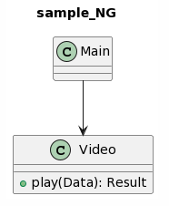
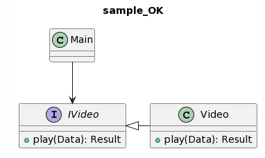

<h1>chapter-5.複雑度</h1>
- プログラムを複雑にする要因について触れる

<!-- TOC -->

- [1. 複雑度の指標](#1-%E8%A4%87%E9%9B%91%E5%BA%A6%E3%81%AE%E6%8C%87%E6%A8%99)
    - [1.1. 循環的サイクロマティック複雑度](#11-%E5%BE%AA%E7%92%B0%E7%9A%84%E3%82%B5%E3%82%A4%E3%82%AF%E3%83%AD%E3%83%9E%E3%83%86%E3%82%A3%E3%83%83%E3%82%AF%E8%A4%87%E9%9B%91%E5%BA%A6)
        - [1.1.1. 循環的複雑度が高くなると...](#111-%E5%BE%AA%E7%92%B0%E7%9A%84%E8%A4%87%E9%9B%91%E5%BA%A6%E3%81%8C%E9%AB%98%E3%81%8F%E3%81%AA%E3%82%8B%E3%81%A8)
        - [1.1.2. 計測方法](#112-%E8%A8%88%E6%B8%AC%E6%96%B9%E6%B3%95)
    - [1.2. 認知的複雑度](#12-%E8%AA%8D%E7%9F%A5%E7%9A%84%E8%A4%87%E9%9B%91%E5%BA%A6)
- [2. 複雑度の要因](#2-%E8%A4%87%E9%9B%91%E5%BA%A6%E3%81%AE%E8%A6%81%E5%9B%A0)
    - [2.1. 条件分岐](#21-%E6%9D%A1%E4%BB%B6%E5%88%86%E5%B2%90)
        - [2.1.1. 書かなくて良い冗長な分岐を書いてしまう](#211-%E6%9B%B8%E3%81%8B%E3%81%AA%E3%81%8F%E3%81%A6%E8%89%AF%E3%81%84%E5%86%97%E9%95%B7%E3%81%AA%E5%88%86%E5%B2%90%E3%82%92%E6%9B%B8%E3%81%84%E3%81%A6%E3%81%97%E3%81%BE%E3%81%86)
            - [2.1.1.1. NG](#2111-ng)
            - [2.1.1.2. OK](#2112-ok)
        - [2.1.2. ANDで結合できる条件を結合しない](#212-and%E3%81%A7%E7%B5%90%E5%90%88%E3%81%A7%E3%81%8D%E3%82%8B%E6%9D%A1%E4%BB%B6%E3%82%92%E7%B5%90%E5%90%88%E3%81%97%E3%81%AA%E3%81%84)
            - [2.1.2.1. NG](#2121-ng)
            - [2.1.2.2. OK](#2122-ok)
        - [2.1.3. 複雑な条件式を関数化しない](#213-%E8%A4%87%E9%9B%91%E3%81%AA%E6%9D%A1%E4%BB%B6%E5%BC%8F%E3%82%92%E9%96%A2%E6%95%B0%E5%8C%96%E3%81%97%E3%81%AA%E3%81%84)
            - [2.1.3.1. NG](#2131-ng)
            - [2.1.3.2. OK](#2132-ok)
        - [2.1.4. 長いswitch-case](#214-%E9%95%B7%E3%81%84switch-case)
            - [2.1.4.1. NG](#2141-ng)
            - [2.1.4.2. OK](#2142-ok)
            - [2.1.4.3. OK](#2143-ok)
        - [2.1.5. 特別扱いのパスを無闇に追加してしまう](#215-%E7%89%B9%E5%88%A5%E6%89%B1%E3%81%84%E3%81%AE%E3%83%91%E3%82%B9%E3%82%92%E7%84%A1%E9%97%87%E3%81%AB%E8%BF%BD%E5%8A%A0%E3%81%97%E3%81%A6%E3%81%97%E3%81%BE%E3%81%86)
            - [2.1.5.1. NG](#2151-ng)
        - [2.1.6. 意図を持たない引数で処理を分岐させてしまう](#216-%E6%84%8F%E5%9B%B3%E3%82%92%E6%8C%81%E3%81%9F%E3%81%AA%E3%81%84%E5%BC%95%E6%95%B0%E3%81%A7%E5%87%A6%E7%90%86%E3%82%92%E5%88%86%E5%B2%90%E3%81%95%E3%81%9B%E3%81%A6%E3%81%97%E3%81%BE%E3%81%86)
            - [2.1.6.1. NG](#2161-ng)
            - [2.1.6.2. OK](#2162-ok)
    - [2.2. ネスト](#22-%E3%83%8D%E3%82%B9%E3%83%88)
        - [2.2.1. 早期にreturnしない](#221-%E6%97%A9%E6%9C%9F%E3%81%ABreturn%E3%81%97%E3%81%AA%E3%81%84)
            - [2.2.1.1. NG](#2211-ng)
            - [2.2.1.2. OK](#2212-ok)
    - [2.3. 繰り返し](#23-%E7%B9%B0%E3%82%8A%E8%BF%94%E3%81%97)
        - [2.3.1. 車輪の再開発になる繰り返しを書いてしまう](#231-%E8%BB%8A%E8%BC%AA%E3%81%AE%E5%86%8D%E9%96%8B%E7%99%BA%E3%81%AB%E3%81%AA%E3%82%8B%E7%B9%B0%E3%82%8A%E8%BF%94%E3%81%97%E3%82%92%E6%9B%B8%E3%81%84%E3%81%A6%E3%81%97%E3%81%BE%E3%81%86)
            - [2.3.1.1. NG](#2311-ng)
            - [2.3.1.2. OK](#2312-ok)
        - [2.3.2. ループの周回数に伴い実行パスが移り変わるパターン](#232-%E3%83%AB%E3%83%BC%E3%83%97%E3%81%AE%E5%91%A8%E5%9B%9E%E6%95%B0%E3%81%AB%E4%BC%B4%E3%81%84%E5%AE%9F%E8%A1%8C%E3%83%91%E3%82%B9%E3%81%8C%E7%A7%BB%E3%82%8A%E5%A4%89%E3%82%8F%E3%82%8B%E3%83%91%E3%82%BF%E3%83%BC%E3%83%B3)
            - [2.3.2.1. NG](#2321-ng)
            - [2.3.2.2. OK](#2322-ok)
    - [2.4. 並列性](#24-%E4%B8%A6%E5%88%97%E6%80%A7)
        - [2.4.1. RAIIでないlock/unlockパターンで排他制御する](#241-raii%E3%81%A7%E3%81%AA%E3%81%84lockunlock%E3%83%91%E3%82%BF%E3%83%BC%E3%83%B3%E3%81%A7%E6%8E%92%E4%BB%96%E5%88%B6%E5%BE%A1%E3%81%99%E3%82%8B)
            - [2.4.1.1. NG](#2411-ng)
            - [2.4.1.2. OK](#2412-ok)
        - [2.4.2. atomicにするべき処理中に未lockな状態を作ってしまう](#242-atomic%E3%81%AB%E3%81%99%E3%82%8B%E3%81%B9%E3%81%8D%E5%87%A6%E7%90%86%E4%B8%AD%E3%81%AB%E6%9C%AAlock%E3%81%AA%E7%8A%B6%E6%85%8B%E3%82%92%E4%BD%9C%E3%81%A3%E3%81%A6%E3%81%97%E3%81%BE%E3%81%86)
            - [2.4.2.1. NG](#2421-ng)
            - [2.4.2.2. OK](#2422-ok)
    - [2.5. 依存性結合度/凝集度](#25-%E4%BE%9D%E5%AD%98%E6%80%A7%E7%B5%90%E5%90%88%E5%BA%A6%E5%87%9D%E9%9B%86%E5%BA%A6)
        - [2.5.1. 結合度](#251-%E7%B5%90%E5%90%88%E5%BA%A6)
        - [2.5.2. 凝集度](#252-%E5%87%9D%E9%9B%86%E5%BA%A6)
        - [2.5.3. 結合度を低く、凝集度を高く設計しようとすると...](#253-%E7%B5%90%E5%90%88%E5%BA%A6%E3%82%92%E4%BD%8E%E3%81%8F%E5%87%9D%E9%9B%86%E5%BA%A6%E3%82%92%E9%AB%98%E3%81%8F%E8%A8%AD%E8%A8%88%E3%81%97%E3%82%88%E3%81%86%E3%81%A8%E3%81%99%E3%82%8B%E3%81%A8)
        - [2.5.4. 参考リンク](#254-%E5%8F%82%E8%80%83%E3%83%AA%E3%83%B3%E3%82%AF)
        - [2.5.5. 変更される実装に依存している](#255-%E5%A4%89%E6%9B%B4%E3%81%95%E3%82%8C%E3%82%8B%E5%AE%9F%E8%A3%85%E3%81%AB%E4%BE%9D%E5%AD%98%E3%81%97%E3%81%A6%E3%81%84%E3%82%8B)
            - [2.5.5.1. OK](#2551-ok)
    - [2.6. 行数](#26-%E8%A1%8C%E6%95%B0)
        - [2.6.1. 長いコードが複雑になりやすい理由](#261-%E9%95%B7%E3%81%84%E3%82%B3%E3%83%BC%E3%83%89%E3%81%8C%E8%A4%87%E9%9B%91%E3%81%AB%E3%81%AA%E3%82%8A%E3%82%84%E3%81%99%E3%81%84%E7%90%86%E7%94%B1)
        - [2.6.2. 複雑になった関数はテスタビリティが低く、性能を担保できる十分なテストが難しいあるいは不可能](#262-%E8%A4%87%E9%9B%91%E3%81%AB%E3%81%AA%E3%81%A3%E3%81%9F%E9%96%A2%E6%95%B0%E3%81%AF%E3%83%86%E3%82%B9%E3%82%BF%E3%83%93%E3%83%AA%E3%83%86%E3%82%A3%E3%81%8C%E4%BD%8E%E3%81%8F%E6%80%A7%E8%83%BD%E3%82%92%E6%8B%85%E4%BF%9D%E3%81%A7%E3%81%8D%E3%82%8B%E5%8D%81%E5%88%86%E3%81%AA%E3%83%86%E3%82%B9%E3%83%88%E3%81%8C%E9%9B%A3%E3%81%97%E3%81%84%E3%81%82%E3%82%8B%E3%81%84%E3%81%AF%E4%B8%8D%E5%8F%AF%E8%83%BD)
        - [2.6.3. 関数が長いこと自体がアンチパターン](#263-%E9%96%A2%E6%95%B0%E3%81%8C%E9%95%B7%E3%81%84%E3%81%93%E3%81%A8%E8%87%AA%E4%BD%93%E3%81%8C%E3%82%A2%E3%83%B3%E3%83%81%E3%83%91%E3%82%BF%E3%83%BC%E3%83%B3)

<!-- /TOC -->

# 1. 複雑度の指標
 
## 1.1. 循環的(サイクロマティック)複雑度
- Cyclomatic Complexity Numberの頭文字を取ってCCNと略される
- ソースコードの複雑さを分岐や繰り返しに基づき計算した指標
- 関数の複雑度≒その関数の品質を担保するために必要となるUnitTestケースの数
- 複雑度の数値が高い関数ほどより多くの経路が存在するため、必要なテストケースが増える

### 1.1.1. 循環的複雑度が高くなると...
- [Understand Blog: ソースコードの複雑さの評価](http://understand-jp.blogspot.com/2012/06/blog-post.html)

| 循環的複雑度 | 複雑さの状態               | バグ混入確率 |
| ------------ | -------------------------- | ------------ |
| ~10          | 非常に良い構造             | 25%          |
| 30~          | 構造的リスク有り           | 40%          |
| 50~          | テスト不可能               | 70%          |
| 75~          | いかなる変更も誤修正となる | 98%          |

- 基本的に10以下を目指すべき
- 普段自分が書く関数に必要なUnitTestが10個を超えるようなら...
	- もっと関数を分割できるかも？
	- もっと分岐や繰り返しを減らせるかも？
	- 等と考えてみた方が良い

### 1.1.2. 計測方法
- [lizardでMcCabeの循環的複雑度を測る - Qiita](https://qiita.com/n_morioka/items/69f59c359bbd15db7821)

## 1.2. 認知的複雑度
- [Cognitive Complexity で、コードの読みやすさを定量的に計測しよう - Qiita](https://qiita.com/suzuki_sh/items/824c36b8d53dd2f1efcb)

# 2. 複雑度の要因
 
## 2.1. 条件分岐
- if, switchによる条件分岐は可能な限り書かずに済ませたい
- 関数の処理の流れが線形となる(見える)ように実装したい
- 参考リンク : [分岐アンチパターン - Qiita](https://qiita.com/pakkun/items/9bef9132f168ba0befd7)

### 2.1.1. 書かなくて良い冗長な分岐を書いてしまう
- 入力に基づき条件を判定し、何らかの値を返す関数について
- true/falseのどちらか一方で初期化し、他方の条件をチェックすることで成立する分岐ではelseブロックを書く必要が無い
- 条件を網羅しなくて良い訳ではなく、より簡潔な書き方で網羅できる場合があることを意識しよう

#### 2.1.1.1. NG
```cpp
bool isEnabled(int x){
	bool isEnabled;
	if(x > 10){
		isEnabled = true;
	}else{
		isEnabled = false;
	}
	return isEnabled;
}
```

#### 2.1.1.2. OK
```cpp
bool isEnabled(int x){
	bool isEnabled = false;
	if(x > 10) isEnabled = true;
	return isEnabled;
}
```

```cpp
bool isEnabled(int x){
	if(x > 10) return true;
	return false;
}
```

```cpp
bool isEnabled(int x){
	return x > 10;
}
```

### 2.1.2. ANDで結合できる条件を結合しない
- elseブロックでやるべき処理が同じ場合、2つの条件分岐はANDで結合できる場合が多い
- 後述するネストの原因にもなるので、ネストが減るメリットを優先してAND結合するべき

#### 2.1.2.1. NG
```cpp
bool isEnabledA();
bool isEnabledB();

void func(){
	if(isEnabledA()){
		if(isEnabledB()){
			// ToDo
		}else{
			// error処理
		}
	}else{
		// error処理
	}
}
```

#### 2.1.2.2. OK
```cpp
bool isEnabledA();
bool isEnabledB();

void func(){
	if(isEnabledA() && isEnabledB()){
		// ToDo
	}else{
		// error処理
	}
}
```

### 2.1.3. 複雑な条件式を関数化しない
- if文に直接記述された複雑な条件式は、何を表現しているのかが伝わりにくい
- 条件式を関数にまとめ、適切な関数名を与えることで何の真偽を判定しているのかを明示する必要がある
- 呼び出し元にとって興味が無い条件式の詳細は、関数に隠蔽するべき

#### 2.1.3.1. NG
```cpp
void func(int x, int a, int b){
	// xxxか否かを判定する
	if(x > 10 && a < 5 || b == 3){
		// ToDo 1
	}else{
		// ToDo 2
	}
}
```

#### 2.1.3.2. OK
```cpp
// xxxか否かを判定して返す関数
bool isEnabledXXX(int x, int a, int b){
	return x > 10 && a < 5 || b == 3;
}

void func(int x, int a, int b){
	if(isEnabledXXX(x, a, b)){
		// ToDo 1
	}else{
		// ToDo 2
	}
}
```

### 2.1.4. 長いswitch-case
- 各caseの処理が1行だけだったとしても、caseが増える度にcaseラベルとbreak文の行が漏れなく付いてくる
- switch文のcase増加で認知的複雑度は上がらないが、循環的複雑度は上がってしまう

#### 2.1.4.1. NG
```cpp
enum Type{ A, B, C, ..., Z };
void func(Type type){
	switch(type){
		case A:
			funcA();
			break;
		case B:
			funcB();
			break;
		// 以下、case Zまで続く
		case Z:
			funcZ();
			break;
		default:
			break;
	}
}
void main(){
	func(Type::A);
}
```

- std::mapなどのkeyValueStoreでcaseと処理をmappingする解決方法もある
- caseラベルと対応する処理を紐付けたmapを作り、引数のtypeをkeyとしてmapから処理を取り出して呼び出す
- この場合はcaseラベルとbreak文が不要で、循環的複雑度も上がらない
- caseが増えた場合はmapに紐付けのkeyValueを追加する必要があり、func()の実装が変わる

#### 2.1.4.2. OK
```cpp
#include <map>
#include <functional>
enum Type{ A, B, C, ..., Z };
void func(Type type){
	static const std::map<Type, std::function<void()>> map{
		{ A, []{ funcA(); } },
		{ B, []{ funcB(); } },
		// 以下、Zまで続く
		{ Z, []{ funcZ(); } }
	};
	if(map.count(type) > 0){
		map.at(type)();
	}else{
		// case default
	}
}
void main(){
	func(Type::A);
}
```

- オブジェクト指向的に解決するなら、Stateパターンによる解決方法がある
- case毎にclassの定義が必要となるが、caseがいくら増えてもfunc()の実装は一切変更する必要が無い

#### 2.1.4.3. OK
```cpp
class IState{
	virtual void doEvent() = 0;
};

class StateA : public IState{
	void doEvent() override{
		funcA();
	}
};

class StateB : public IState{
	void doEvent() override{
		funcB();
	}
};
// 以下、class StateZまで続く

void func(std::shared_ptr<Istate> state){
	if(state){
		state->doEvent();
	}else{
		// case default
	}
}
void main(){
	func(std::make_shared<StateA>());
}
```

### 2.1.5. 特別扱いのパスを無闇に追加してしまう
- ジェンガの如く条件が増え続けるパターン
- これが2~3回重なるだけで相当複雑になってしまう
- 機能仕様から防ぐべきケースかもしれない
- せめてToDoの部分は副作用の無い関数に切り出してテストを書きやすくしよう

#### 2.1.5.1. NG
```cpp
void func(){
	if(isEnabledX()){
		// ToDo X
	}else{
		// ToDo Y
	}
}

/************************************
ToDo Y条件の時、条件Zを満たした場合のみ、
ToDo Zを実行する修正が必要になった
************************************/

void func(){
	if(isEnabledX()){
		// ToDo X
	}else{
		// ToDo Y
		
		if(isEnabledZ()){
			// ToDo Z
		}
	}
}
```

### 2.1.6. 意図を持たない引数で処理を分岐させてしまう
- 引数で条件分岐する構造は日常的に発生すると思うが、その引数は呼び出し元が知っているべきものだろうか？
- 引数は呼び出し元が渡すものなので、呼び出し元にとって興味のあるものでなければならない
- 「関数内部で条件分岐が必要になったから分岐用の引数を外から指定できるようにしよう」という考え方は危険
	- 分岐の条件を引数にした瞬間、関数内部の詳細が外に漏れだしたことになる
	- 「引数のフラグをfalseにしてこの関数を呼び出すと内部でこんな挙動になる」という関数内部の詳細は呼び出し元が知っているべきではない
- **"その引数、本当に呼び出し元が知っていても良いものだろうか？"** を意識して欲しい

#### 2.1.6.1. NG
```cpp
// NG : 映像を停止する関数に意図が不明なフラグを渡すのは不自然
// 呼び出し元はどのような時にswitchFlagをtrueで渡すべきか？
// stopVideo()内部の詳細を知らないと決められないようなフラグは引数にすべきではない
void stopVideo(bool switchFlag){
	if(switchFlag){
		// ToDo A
	}else{
		// ToDo B
	}
}
```

#### 2.1.6.2. OK
```cpp
// OK : 映像を再生する関数に再生オプションを渡すのは自然
// 再生オプションの中身による分岐は有り得るだろう
void playVideo(PlayOption option);
// OK : 音量を変更する関数に音量値を渡すのは自然
// 音量の値によっては分岐が必要になるかも知れない
void changeVolume(float volume);
```

## 2.2. ネスト
- 階層が深くなるほど、"今いるネスト階層を通る条件は何か"を多重で覚えながら読まなければならない
- ネストは読むコストを容易に上げてしまうので、ネストの階層は極力浅くなるように実装しよう


### 2.2.1. 早期にreturnしない
- elseブロックの処理が異なる場合はAND結合でまとめることが出来ない
- NG例の各ToDoを実行する条件を把握しながら読むのはコストが掛かってしまう

#### 2.2.1.1. NG
```cpp
void func(){
	if(A()){
		if(B()){
			if(C()){
				// ToDo 1
			}else{
				// ToDo 2
			}
		}else{
			// ToDo 3
		}
	}else{
		// ToDo 4
	}
}
```

- 昔は"returnは関数内で1つだけにするべき"みたいな教えもあったが...
- ネストによる複雑度上昇を考えるとOK例のようなeary returnで階層を浅く保つ方が良い

#### 2.2.1.2. OK
```cpp
void func(){
	if(!A()){
		// ToDo 4
		return;
	}
	if(!B()){
		// ToDo 3
		return;
	}
	if(!C()){
		// ToDo 2
		return;
	}
	// ToDo 1
}

```

## 2.3. 繰り返し
- for文は道具であり、目的ではない

### 2.3.1. 車輪の再開発になる繰り返しを書いてしまう
- 例えば"配列に格納された全ての構造体がある条件を満たしているか否かを調べたい"場合を考える
- NG例ではisEvenNumberList()が引数に受け取った配列に対してfor文を適用
	- 要素を1個ずつ取り出し、偶数か否か検証する繰り返しを実装している
	- 1個でも奇数が見つかればfalseが返され、所望の結果が得られる
- ここで気を付けて欲しいのは、"**本当にやりたいことはfor文でループを回すことではない**"ということ

#### 2.3.1.1. NG

```cpp
#include <stream>
#include <vector>

struct Data{
	int x{};
};

// 全ての要素が偶数であるか否かを調べて返す
bool isEvenNumberList(const std::vector<Data>& list){
	for(int i = 0; i < list.size(); i++){
		if(list[i].x % 2 != 0){
			// 2で割り切れなかった場合
			return false;
		}
	}
	// 全ての要素が2で割り切れた場合
	return true;
}

void main(){
	std::vector<Data> list{
		{2}, {4}, {6}, //...
	};
	std::cout << isEvenNumberList(list);
}
```

- OK例ではfor文を使わず、C++標準ライブラリのstd::all_of()を使って配列を検査している
- std::all_of()は[algorithmヘッダ]([https://cpprefjp.github.io/reference/algorithm.html](https://cpprefjp.github.io/reference/algorithm.html))が提供する関数で、指定した範囲の全てのデータが、指定した条件を満たすか否かを検査してくれる
- C++言語に限らず、この手の検査、検索、加工に関する処理は標準ライブラリが提供していることが多い
- NG例のようなfor文実装は車輪の再開発になりがちで、for文がやろうとする意図が読み手に伝わりにくい
	- 標準ライブラリが用意した関数なら用途が明確で、意図が伝わりやすい
- 常に"**この処理、もしかして標準ライブラリが既に用意しているのでは？**"を考えて欲しい

#### 2.3.1.2. OK
```cpp
#include <stream>
#include <vector>
#include <algorithm>

struct Data{
	int x{};
};

bool isEvenNumberList(const std::vector<Data>& list){
	// 引数のリスト全てが"偶数か否か"チェックを満たしているか否かを返す
	return std::all_of(list.begin(), list.end(), [](const Data& data){
		// 配列の1要素が偶数であるか否かを返す
		return data.x % 2 == 0;
	});
}

void main(){
	std::vector<Data> list{
		{2}, {4}, {6}, //...
	};
	std::cout << isEvenNumberList(list);
}
```

### 2.3.2. ループの周回数に伴い実行パスが移り変わるパターン
- 例として、"テキストファイルから設定を読み込む場合"を考える
- NG例では、1行ずつ取り出して探したい設定が書いてある行か否かを検査している
- 探したい設定のキーはテキストファイルの上から順に書いてあることを期待した実装になっている
- 1行見つかるたびにcontinueし、検査する行が進む毎にwhileループ内で実行される処理が下へ進むようになっている
- 繰り返しの周回数によって実行されるパスが変化していくような構造は読みにくい
- 設定値を取り出すだけならまだマシかも知れないが、ループ内でstatic変数やメンバ変数を参照して分岐やループを制御している場合は要注意

#### 2.3.2.1. NG
```cpp
/*******settings.txt**********
speed=1.0
volume=0.5
filePath=/var/movie/test.mp4
:
******************************/

void func(){
	while(file.readline(line)){
		if(line.startWith("speed")){
			// ToDo for speed
			continue;
		}
		if(line.startWith("volume")){
			// ToDo for volume
			continue;
		}
		if(line.startWith("filePath")){
			// ToDo for filePath
			continue;
		}
		// 以下、settings.txtの各行を走査する処理が続く
	}
}
```

- いつでも適用できる訳ではないが、ファイルから設定値を取り出すなら対応するparserを使うのが良い
- xml, jsonならC++向けのparserもある(YAML, TOML辺りは無いかも...)
- **ループを回したいのではなく、ファイルから設定値を取り出したい**のだから、よりそれらしく見える方法を採用するべき

#### 2.3.2.2. OK
```cpp
/*******settings.json*********
{
	"speed" : "1.0",
	"volume" : "0.5",
	"filePath" : "/var/movie/test.mp4"
}
******************************/
#include "json11.hpp"
void func(){
	std::string err{};
	const auto json = json11::Json::parse(file.read(), err);
	const auto speed = json["speed"].float_value();
	const auto volume = json["volume"].float_value();
	const auto filePath = json["filePath"].string_value();
}
```

## 2.4. 並列性
- 複数の処理が非同期に動作するプログラムはすぐに複雑になってしまう
- 非同期処理の文脈ではthread, mutex, future/promise, async/await, coroutineといったキーワードが出てくる
- スレッドセーフに作るためのデザインパターンには下記リンク先のようなものがある
	- [デザインパターン入門 マルチスレッド編まとめ - リトルプログラマーの日記](https://otuzak.hatenadiary.org/entry/20080527/1211864889)
- 他にも以下のような定石があるが、ここではいくつかのアンチパターンについて説明する
	- 関数を副作用の無いreadonlyな作りにする(C++なら関数をconstやconstexpr化する)
	- read/writeの役割を分離する(状態の書き換え責務を1つのスレッドが負うようにする)
- 参考リンク : [スレッドセーフという幻想と現実 - yohhoyの日記（別館）](https://yohhoy.hatenablog.jp/entry/2013/12/15/204116)

### 2.4.1. RAIIでないlock/unlockパターンで排他制御する
- NG例では従来型のlock/unlockパターンによる排他制御を書いた
- このパターンでは共有リソースの変更処理で例外が出た時にpthread_mutex_unlock()の実行が保証されない
- このため、確実にunlockが実行されるよう例外のハンドリングも行う必要があり、間違えやすい

#### 2.4.1.1. NG
```cpp
#include <pthread.h>
pthread_mutex_t mutex;
void func(){
	pthread_mutex_lock(&mutex);
	// mutexがlockされた状態
	// unlockするまで共有リソースを安全に変更可能
	pthread_mutex_unlock(&mutex);
}
```

- [RAII - Wikipedia](https://ja.wikipedia.org/wiki/RAII)
- [RAII解説 - Qiita](https://qiita.com/wx257osn2/items/e2e3bcbfdd8bd02872aa)
- RAIIは排他制御だけでなく、C++のnew/deleteにおけるdelete漏れ問題の解決にも使われている(スマートポインタ)
- 要は"**必ず実行しなければならない後始末処理が確実に実行されるようデストラクタに仕込む**"のがRAIIである
- C++の排他制御でこれを提供してくれるのがstd::lock_guradである
- std::lock_guardは変数の寿命が尽きる時、デストラクタでmutexをunlockしてくれる
- 共有リソースの変更中に例外が出たとしてもデストラクタは実行されるため、unlock漏れは絶対に発生しない、安全！

#### 2.4.1.2. OK
```cpp
#include <mutex>
std::mutex mutex{};
void func(){
	std::lock_guard<std::mutex> lock(mutex);
	// mutexがlockされた状態
	// lock変数の寿命が尽きるまで共有リソースを安全に変更可能
	// lock変数の寿命が尽きた時、自動的にunlockされる
}
```

### 2.4.2. atomicにするべき処理中に未lockな状態を作ってしまう
- 下記の例ではxxx_valueを排他制御するためのmutexが用意されている
- xxx_valueに対するset/get時はmutexがlockされ、割り込まれないようになっている
- NG例ではfunc()においてgetValue()を2回呼び出しており、ここが誤っている
- 1回目と2回目のgetValue()の間はlockされない区間となるため、他のスレッドからsetValue()されてもおかしくない
- 値チェックに合格したと思ったら、2回目のgetValue()時点ではxxx_valueが負の値になっていても不思議ではない

#### 2.4.2.1. NG
```cpp
#include <mutex>

std::mutex mutex{};
static int xxx_value{};

void setValue(int value){
	std::lock_guard<std::mutex> lock(mutex);
	xxx_value = value;
}

int getValue(){
	std::lock_guard<std::mutex> lock(mutex);
	return xxx_value;
}

void func(){
	// 1回目のgetValue()で値のチェック
	if(getValue() > 0){
		// 値チェックに合格した場合
		// 2回目のgetValue()
		setValue(getValue() + 10);
	}
}
```

- getValue()呼び出しを1回だけにすることで、NG例の問題は回避できる

#### 2.4.2.2. OK
```cpp
void func(){
	const auto value = getValue();
	if(value > 0){
		setValue(value + 10);
	}
}
```

## 2.5. 依存性(結合度/凝集度)

### 2.5.1. 結合度
- モジュール間の依存度合いを表し、低いほど良い構造とされる
- 結合度を低く設計するには"**他のモジュールに対して無関心、他人事の態度を貫くこと**"が大事

### 2.5.2. 凝集度
- 1個のモジュールがどれだけ責務に集中できているかの度合いを表し、高いほど良い構造とされる
- 凝集度を高く設計するには"**モジュールが担当する仕事以外は絶対にやらないこと**"が大事

### 2.5.3. 結合度を低く、凝集度を高く設計しようとすると...
- "**自分以外のことには全く関心が無く、与えられた仕事以外はやらない、やろうとしない**"ようなモジュールにするべき
- ↑のような疎結合＆高凝集な人間は歓迎されないかも知れないが、プログラムの世界では歓迎される

### 2.5.4. 参考リンク
- [モジュール結合度について - Qiita](https://qiita.com/eKushida/items/39bdb3f88fb68ecd66f6)
- [凝集度・結合度・循環的複雑度 - Qiita](https://qiita.com/oda-kazuki/items/a16b43dc624429de7db3#凝集度)
- [プログラムの依存関係とモジュール構成のこと - Qiita](https://qiita.com/wm3/items/2c90bfd9e973d368ebd8)

### 2.5.5. 変更される実装に依存している
- 次のNG例では2つのレイヤーMain, Videoがあり、MainはVideo::play()を呼び出して(=依存して)いる
- 機能追加でVideo::play()の修正が必要になり、play()の名前、引数、戻り値に変更が必要になった場合...
	- MainでVideo::play()を呼び出している部分についても実装の変更が必要になってしまう
	- Video::play()修正に伴いMainも変更しなければならないのは、Mainが"**変更されやすいモジュールに依存している**"ためである
	- 依存の方向には安定性があり、変更されにくいモジュールに依存するべきとされている

```puml
title sample_NG
class Main
class Video{
	+ play(Data): Result
}
Main --> Video
```
 


- 依存の方向が常に安定する(=変更されにくいモジュールに向く)よう設計するのは難しい
- Videoの変更がMainに波及しないようにするための方法として、interfaceがある
	- Videoはinterfaceを継承し、"**interface部分は変更しない**"という契約で実装する
	- MainはVideoではなくinterfaceであるIVideoに依存することになる
	- IVideo::play()はMainとVideoの間で変更されにくいもの、と約束されている(=厳密にはそのようにinterfaceを設計する)
	- Main->IVideoの依存は安定したものになり、Videoの修正はMainに波及しなくなる
		- 勿論、IVideoの変更が必要になったらMain側に影響が及ぶ
		- そのため、interfaceは変更されにくいものでなければならない
- この考え方はクラス間に限ったものではなく、単一クラス内の関数呼び出しについても同様である
	- 関数の詳細な実装に呼び出し元が依存している場合、関数の変更の影響が呼び出し元にも波及することになる
	- だから関数の入出力となる引数、戻り値は変更されにくいものであることが望ましい

```plantuml
title sample_OK
class Main
interface IVideo{
	+ play(Data): Result
}
class Video{
	+ play(Data): Result
}
Main --> IVideo
Video -le-|> IVideo
```




#### 2.5.5.1. OK
```cpp
#include <memory>

class IVideo{
public:
	virtual void play(const Data& data) = 0
};

class Video : public IVideo{
public:
	void play(const Data& data) override{
		// 中身を実装する
	}
};

int main(){
	auto video = std::unique_ptr<IVideo>(new Video());
	auto data = Data();
	video->play(data);
}
```

## 2.6. 行数

### 2.6.1. 長いコードが複雑になりやすい理由
- 複数の責務が紛れ込みやすい >> 複数の理由で変更され得る
- 処理が冗長で非効率な可能性が高い >> もっと短く実装できるのに、車輪の再開発をしている可能性がある

### 2.6.2. 複雑になった関数はテスタビリティが低く、性能を担保できる十分なテストが難しい(あるいは不可能)
- テストが難しいと、未評価なパスを残したままリリースすることになる
- 未評価パスは将来不具合の原因と成り得る
- 複雑になった関数で発生した不具合の修正は難しい(テスタビリティが低い程、修正の難易度は増大する)
- 修正方法を間違える、より複雑になる修正しか出来ない等で更に不具合が増える
- 複雑な関数は悪循環しか生み出さない >> だから複雑でなく単純に作る必要がある

### 2.6.3. 関数が長いこと自体がアンチパターン
- とにかく関数は極限まで短く作ることを心がけよう
- 具体的には1関数10~20行を目指して欲しい
- 100行超えたら完全にアウト

