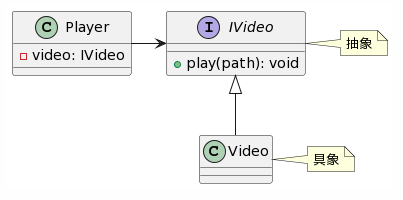
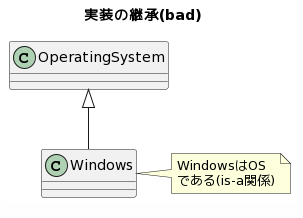

<h1>chapter-6.オブジェクト指向の特徴</h1>


<!-- TOC -->

- [1. 抽象化](#1-%E6%8A%BD%E8%B1%A1%E5%8C%96)
    - [1.1. 特徴](#11-%E7%89%B9%E5%BE%B4)
    - [1.2. 設計・コーディングの際に気を付けたいこと](#12-%E8%A8%AD%E8%A8%88%E3%83%BB%E3%82%B3%E3%83%BC%E3%83%87%E3%82%A3%E3%83%B3%E3%82%B0%E3%81%AE%E9%9A%9B%E3%81%AB%E6%B0%97%E3%82%92%E4%BB%98%E3%81%91%E3%81%9F%E3%81%84%E3%81%93%E3%81%A8)
        - [1.2.1. ボトムアップな抽象化](#121-%E3%83%9C%E3%83%88%E3%83%A0%E3%82%A2%E3%83%83%E3%83%97%E3%81%AA%E6%8A%BD%E8%B1%A1%E5%8C%96)
        - [1.2.2. トップダウンな抽象化](#122-%E3%83%88%E3%83%83%E3%83%97%E3%83%80%E3%82%A6%E3%83%B3%E3%81%AA%E6%8A%BD%E8%B1%A1%E5%8C%96)
    - [1.3. 抽象化アプローチの違い](#13-%E6%8A%BD%E8%B1%A1%E5%8C%96%E3%82%A2%E3%83%97%E3%83%AD%E3%83%BC%E3%83%81%E3%81%AE%E9%81%95%E3%81%84)
- [2. カプセル化と可視性の制御、情報の隠蔽](#2-%E3%82%AB%E3%83%97%E3%82%BB%E3%83%AB%E5%8C%96%E3%81%A8%E5%8F%AF%E8%A6%96%E6%80%A7%E3%81%AE%E5%88%B6%E5%BE%A1%E6%83%85%E5%A0%B1%E3%81%AE%E9%9A%A0%E8%94%BD)
    - [2.1. 特徴](#21-%E7%89%B9%E5%BE%B4)
    - [2.2. アンチパターン](#22-%E3%82%A2%E3%83%B3%E3%83%81%E3%83%91%E3%82%BF%E3%83%BC%E3%83%B3)
        - [2.2.1. SRPに反するカプセル化](#221-srp%E3%81%AB%E5%8F%8D%E3%81%99%E3%82%8B%E3%82%AB%E3%83%97%E3%82%BB%E3%83%AB%E5%8C%96)
            - [2.2.1.1. NG](#2211-ng)
            - [2.2.1.2. OK](#2212-ok)
        - [2.2.2. 何でも公開する](#222-%E4%BD%95%E3%81%A7%E3%82%82%E5%85%AC%E9%96%8B%E3%81%99%E3%82%8B)
            - [2.2.2.1. NG](#2221-ng)
            - [2.2.2.2. OK](#2222-ok)
- [3. 継承](#3-%E7%B6%99%E6%89%BF)
    - [3.1. 特徴](#31-%E7%89%B9%E5%BE%B4)
    - [3.2. アンチパターン](#32-%E3%82%A2%E3%83%B3%E3%83%81%E3%83%91%E3%82%BF%E3%83%BC%E3%83%B3)
    - [3.3. 継承の使いどころ](#33-%E7%B6%99%E6%89%BF%E3%81%AE%E4%BD%BF%E3%81%84%E3%81%A9%E3%81%93%E3%82%8D)
    - [3.4. 参考リンク](#34-%E5%8F%82%E8%80%83%E3%83%AA%E3%83%B3%E3%82%AF)
- [4. ポリモフィズム多態性](#4-%E3%83%9D%E3%83%AA%E3%83%A2%E3%83%95%E3%82%A3%E3%82%BA%E3%83%A0%E5%A4%9A%E6%85%8B%E6%80%A7)
    - [4.1. 特徴](#41-%E7%89%B9%E5%BE%B4)
    - [4.2. interfaceについて](#42-interface%E3%81%AB%E3%81%A4%E3%81%84%E3%81%A6)
    - [4.3. 静的なポリモフィズムと動的なポリモフィズム](#43-%E9%9D%99%E7%9A%84%E3%81%AA%E3%83%9D%E3%83%AA%E3%83%A2%E3%83%95%E3%82%A3%E3%82%BA%E3%83%A0%E3%81%A8%E5%8B%95%E7%9A%84%E3%81%AA%E3%83%9D%E3%83%AA%E3%83%A2%E3%83%95%E3%82%A3%E3%82%BA%E3%83%A0)
    - [4.4. ポリモフィズムの使いどころ](#44-%E3%83%9D%E3%83%AA%E3%83%A2%E3%83%95%E3%82%A3%E3%82%BA%E3%83%A0%E3%81%AE%E4%BD%BF%E3%81%84%E3%81%A9%E3%81%93%E3%82%8D)
- [5. コンポジション合成](#5-%E3%82%B3%E3%83%B3%E3%83%9D%E3%82%B8%E3%82%B7%E3%83%A7%E3%83%B3%E5%90%88%E6%88%90)
    - [5.1. 特徴](#51-%E7%89%B9%E5%BE%B4)
    - [5.2. 継承よりも合成を好め](#52-%E7%B6%99%E6%89%BF%E3%82%88%E3%82%8A%E3%82%82%E5%90%88%E6%88%90%E3%82%92%E5%A5%BD%E3%82%81)
    - [5.3. 合成の使いどころ継承との使い分け](#53-%E5%90%88%E6%88%90%E3%81%AE%E4%BD%BF%E3%81%84%E3%81%A9%E3%81%93%E3%82%8D%E7%B6%99%E6%89%BF%E3%81%A8%E3%81%AE%E4%BD%BF%E3%81%84%E5%88%86%E3%81%91)
    - [5.4. 参考リンク](#54-%E5%8F%82%E8%80%83%E3%83%AA%E3%83%B3%E3%82%AF)
- [6. Dependency Injection:x:依存性の注入 :o:依存オブジェクトの注入](#6-dependency-injectionx%E4%BE%9D%E5%AD%98%E6%80%A7%E3%81%AE%E6%B3%A8%E5%85%A5-o%E4%BE%9D%E5%AD%98%E3%82%AA%E3%83%96%E3%82%B8%E3%82%A7%E3%82%AF%E3%83%88%E3%81%AE%E6%B3%A8%E5%85%A5)
    - [6.1. 特徴](#61-%E7%89%B9%E5%BE%B4)
    - [6.2. 参考リンク](#62-%E5%8F%82%E8%80%83%E3%83%AA%E3%83%B3%E3%82%AF)

<!-- /TOC -->

# 1. 抽象化

## 1.1. 特徴
- [「抽象化」ってなんだろう？ 〜初心者の理解を助ける例え話〜 - Qiita](https://qiita.com/0w0/items/2cfaf3ca0b653960f5e9)
- 物事をある視点から見た時のコアな要素を切り出し、それ以外の要素を捨てる(捨象)こと
- ある手続きに対して、代表する名前を命名する(=関数化する)ことも抽象化の一種
- オブジェクト指向に限らず、抽象化という考え方はプログラミング全般でとても重要

## 1.2. 設計・コーディングの際に気を付けたいこと
- 抽象化のアプローチにはボトムアップとトップダウンの2種類が考えられる
- ここで言う抽象化には以下が含まれる
	- 具体的な詳細を隠蔽するinterfaceを定義すること
	- 一連の具体的な処理に名前を付け、関数として定義すること

### 1.2.1. ボトムアップな抽象化
- 詳細な手続きを先に実装し、後から意図のまとまりや責務毎に分割していく方法
	- リファクタリング時によく使うアプローチ
	- リファクタリングしようと思った時には手遅れな場合が多い...

1. 要求や要件を実現するための詳細な手続きを実装する
```C++
int main(){
	// ソフトウェアを開発する機能
	// 設計の詳細な実装(50行くらい)
	// コーディングの詳細な実装(50行くらい)
	// ビルドの詳細な実装(50行くらい)
	// UnitTest実行の詳細な実装(50行くらい)
	// レビューの詳細な実装(50行くらい)
	// commitの詳細な実装(50行くらい)
}
```

2. 手続きを意図や責務のまとまりとして整理する
	- ここで奇麗に整理できるなら問題はないが...
	- 大抵の場合は1つの責務を実現するコードが分散していてまとまりにするのが難しかったりする
	- まとめる際に責務や意図とは関係の無いコードまでまとめてしまうリスクもある
	- 1つのまとまりに適切な名前が付けられなければ、それは意図や責務になっていない

```C++
int main(){
	// ソフトウェアを開発する機能
	// 設計する
	// 設計の詳細な実装(50行くらい)
	
	// コードを書く
	// コーディングの詳細な実装(50行くらい)
	
	// ビルドする
	// ビルドの詳細な実装(50行くらい)
	
	// UnitTestを実行する
	// UnitTest実行の詳細な実装(50行くらい)
	
	// レビューをする
	// レビューの詳細な実装(50行くらい)
	
	// 変更を構成管理にcommitする
	// commitの詳細な実装(50行くらい)
}
```

3. 整理したまとまりを関数に分割する
```C++
// ソフトウェアを開発する関数
void developSoftware(){
	// 設計する
	design();
	// コードを書く
	writeCode();
	// ビルドする
	build();
	// UnitTestを実行する
	doTest();
	// レビューをする
	review();
	// 変更を構成管理にcommitする
	commit();
}

int main(){
	developSoftware();
}
```

### 1.2.2. トップダウンな抽象化
- やりたいこと、実現したいことの入出力(≒interface)を先に定義し、後から詳細を決めていく方法
	- 要求やビジネスロジックを実現するために必要な責務が並ぶことになるので、何をしたいコードなのかが分かりやすくなる
	- 入出力定義を先に済ませ、呼び出し元が知る必要の無い詳細は隠蔽されるため、疎結合に作りやすい
	- 実装が似ているロジックを無理やり関数化したりinterface化する訳ではないので、責務が不明な抽象化になりにくい
- 以下にソフトウェアを開発する機能を設計する際のアプローチ例を示す
	- 説明を簡単にする都合上入出力は全て引数・戻り値無しにしている
	- 実際にはちゃんと必要な入出力を考えながら定義する必要がある
	- 抽象化の例として関数分割を取り上げているが、ポリモフィズムが必要ならinterfaceを用いた抽象化に置き換えると良い
		- 例えばコードを書く際に使うエディタやIDEの具体的な詳細が様々なのであれば、IEditor interfaceを切るのも良いだろう

1. 要求や要件を表現する関数の入出力と名前を決める
```C++
// ソフトウェアを開発する関数
void developSoftware();
```

2. 関数の責務(=ソフトウェアを開発する)を実現するために必要な責務を並べる
```C++
// ソフトウェアを開発する関数
void developSoftware(){
	// 設計する
	// コードを書く
	// ビルドする
	// UnitTestを実行する
	// レビューをする
	// 変更を構成管理にcommitする
}
```

3. 各責務の入出力と名前を決め、関数を作る
```C++
// ソフトウェアを開発する関数
void developSoftware(){
	// 設計する
	design();
	// コードを書く
	writeCode();
	// ビルドする
	build();
	// UnitTestを実行する
	doTest();
	// レビューをする
	review();
	// 変更を構成管理にcommitする
	commit();
}
```

4. 責務毎の詳細な実装を決める(呼び出し元であるdevelopSoftware()に対しては隠蔽される)
```C++
// 設計する
void design(){
	// 設計の詳細な実装(50行くらい)
}

// コードを書く
void writeCode(){
	// コーディングの詳細な実装(50行くらい)
}

// 以下、各関数の詳細を決めていく
```

## 1.3. 抽象化アプローチの違い
- リファクタリングでないゼロからの開発であれば、トップダウンな抽象化アプローチを推奨する
	- いきなりポリモフィズムを考慮しなくても良い、関数だけでも抽象化は可能
- 長らく手続き型指向でコーディングしていると急にトップダウンで考えるのは難しい
	- 最初はボトムアップでも良い、後で抽象化することを想定して実装するのが大事


# 2. カプセル化(と可視性の制御、情報の隠蔽)

## 2.1. 特徴
- オブジェクト指向では、データ(=状態、メンバ変数)と振る舞い(=メソッド、関数)をクラス単位にまとめる
- chapter-6では扱わないが、単一責務の原則(=SRP)により、クラスには1つの責務が与えられる
	- 与えられた責務の遂行に必要なデータと振る舞いが1つのクラスにまとめられることになる
	- この時、クラスが責務を遂行する上で利用者に公開すべきものと、そうでないものを区別する必要がある
	- 公開すべきでないもの
		- 振る舞いの詳細な手続き(=メソッドの実装)
		- 振る舞いの実装からのみ参照されるデータ or 振る舞い

```plantuml
class クラス{
	+ 公開すべきデータ
	+ 公開すべき振る舞い()
	- 隠蔽すべきデータ
	- 隠蔽すべき振る舞い() 
}
class 利用者
note bottom : 公開されたデータ/振る舞い\nのみアクセス可能
利用者 -> クラス
```


## 2.2. アンチパターン

### 2.2.1. SRPに反するカプセル化
- クラスが複数の責務を遂行するようなカプセル化はNG、例えば...
	- 通信を担当するクラスがDB操作の振る舞いも持っている
	- videoの再生を担当するクラスがaudio操作の振る舞いも持っている
- 2つの責務が連携して1つの責務を遂行する場合もある
	- videoとaudioが連携して1つの映像(+音)再生を遂行する、とか
	- videoとaudioの両方を持つ別のクラスがその責務を担当するか、
	- あるいはvideo/audioいずれかに連携のためのinterfaceを持たせる、といった形で実現することになる

#### NG
```C++
// 映像の操作を責務とするクラス
class Video{
public:
	void playVideo(const std::string& videoFilePath);
	// Videoの責務とは関係の無い振る舞いが実装されている
	void playAudio(const std::string& audioFilePath);
};
```

#### OK
```C++
// 音の振る舞いに関する入出力をinterfaceとして定義
class IAudio{
	// Audioの再生
	virtual void play(const std::string& filePath) = 0;
};

// IAudioを継承し、音の操作に関する振る舞いを実装する
class Audio : public IAudio{
	// IAudioの契約を実装する
	void play(const std::string& filePath) override{
		// Audio::play()の詳細な実装
	}
};

class Video{
public:
	Video(std::unique_ptr<IAudio> audio);
	void play(const std::string& filePath);
private:
	// 映像の再生責務の一環として、映像と音の連携が必要な場合もある
	// 映像から音の操作をするためのinterfaceを持つようにする
	std::unique_ptr<IAudio> audio{};
};
```

### 2.2.2. 何でも公開する
- クラスの利用者に関係の無いデータや振る舞いを公開してはならない
- 常に"このメンバは外から見えているべきだろうか？"を考え、適切に可視性を制御する必要がある
- 例えば以下の例ではVideo::decoderがpublicになっており、利用者から参照できる状態にある
	- 要件次第だが、Videoクラスの利用者にとってデコード処理を実行するデコーダが何なのか、を知らなくて良いのであれば、publicにするべきではない
	- 利用者が指定したファイルパスの映像を再生する、というだけの要件であれば、デコードに関する事情は隠蔽するべき

#### NG
```C++
class Video{
public:
	// デコード用のオブジェクト
	Decoder decoder{};
	void play(const std::string& filePath){
		// decoderを使った再生処理が続く
	}
};
```

#### OK
```C++
class Video{
public:
	void play(const std::string& filePath){
		// decoderを使った再生処理が続く
	}
private:
	// デコード用のオブジェクト
	Decoder decoder{};
};
```


# 3. 継承

## 3.1. 特徴
- 基底クラスの定義を引き継いでそれらを実装/拡張する仕組み
- 共通化や差分プログラミングのテクニックであるかのように解説されることがある(間違い)
	- そうではなく、interfaceと実装を分離するための仕組みと捉えるべき

```plantuml
class Base{
	+ x: int
	+ func1(): void
}
note right : 基底クラス
class Derived{
	+ y: float
	+ func2(): void
} 
note right : 派生クラス(基底クラスの要素を引き継ぐ)
Base <|-- Derived : 継承
```


## 3.2. アンチパターン
- 下図に示すような実装の継承はアンチパターンと言える
	- 基底クラスの実装を派生クラスが書き換え(override)可能であるため
	- 派生クラスに関係の無い基底クラスへの変更が難しくなるため
- 共通の処理を持たせたいなら、"**継承よりも合成(コンポジション)を好め**"
	- 詳細はコンポジションの項を参照

```plantuml
class Base{
	+ x: int
	+ funcX()
}
note right : xとfuncX()を派生クラスに\n共通で持たせたい
class Derived1{
	+ funcY()
}
note bottom : Baseを引継ぎ\nfuncY()を拡張
class Derived2{
	+ funcZ()
}
note bottom : Baseを引継ぎ\nfuncZ()を拡張
Base <|-- Derived1
Base <|-- Derived2
```


## 3.3. 継承の使いどころ
- 継承は実装ではなく抽象(interface, abstract)に対して使うべき
	- ある機能を抽象と実装(具象)に分離し、利用者には抽象部分だけを提供する
	- 利用者から隠蔽すべき情報を実装に詰め込み、モジュール間の結合度を下げる
- 継承の目的は**抽象と具象の分離**なので、継承するクラスは1個でも構わない
	- ある処理を2個以上のクラスに共通で持たせるために継承を使っている訳ではない
- 下図の例ではVideoクラス実装の変更はPlayerクラスに影響しない
	- IVideoが提供するinterfaceにまで変更が及んだ場合はPlayerクラスの変更も必要

```plantuml
interface IVideo{
	+ play(path): void
}
note right: 抽象
class Video{}
note right: 具象
class Player{
	- video: IVideo
}
IVideo <|-- Video
Player -> IVideo
```



## 3.4. 参考リンク
- [君の継承の使い方は間違っている - Qiita](https://qiita.com/tonluqclml/items/c0110098722763caa556)
- [共通化という考え方はアンチパターンを生み出すだけ説 - タオルケット体操](https://hachibeechan.hateblo.jp/entry/dont-think-just-make-it-abstract)

# 4. ポリモフィズム(多態性)

## 4.1. 特徴
- interfaceの呼び出しで実行される振る舞いが、その具体的な実装によって決まること
- interfaceの利用者は実体が何なのかを気にする必要がなくなり、利用者と実体の結合度が疎になる
	- 具体的な実装の詳細が利用者に見えないよう、interfaceにより隠蔽される

## 4.2. interfaceについて
- C++においてinterfaceは、純粋仮想関数の宣言のみをメンバとして持つclassとして表現される
	- 故にインスタンスを作ることも、参照として渡すことも不可能(ポインタ渡しするしかない)
- classとは別にinterfaceキーワードで定義する言語もある

```plantuml
interface ISearchEngine{
	+ search(const std::string& word)
}
class GoogleEngine
class BingEngine
ISearchEngine <|-- GoogleEngine
ISearchEngine <|-- BingEngine
```


```C++
#include <iostream>
#include <memory>

// ここでは検索エンジンinterfaceを定義する
class ISearchEngine{
public:
	virtual void search(const std::string& word) = 0;
};

// google検索エンジンはISearchEngine::search()をgoogle向けに実装する
class GoogleEngine : public ISearchEngine{
	void search(const std::string& word) override{
	    std::cout << "this is google engine" << std::endl;
	}
};

// Bing検索エンジンはISearchEngine::search()をBing向けに実装する
class BingEngine : public ISearchEngine{
    void search(const std::string& word) override{
        std::cout << "this is Bing engine" << std::endl;
    }
};

// 検索エンジンのinterfaceが引数として渡される
// (実体がgoogleなのかBingなのかは知らない、知らなくて良い)
void someWork(std::unique_ptr<ISearchEngine> searchEngine){
    // 実体が何であっても、search()を呼び出すだけ
    // 呼び出し元が渡した実体に応じて、その振る舞いが変わる(ポリモフィズム)
	searchEngine->search("some word");
}

// output
// this is google engine
// this is Bing engine
int main(){
    // Google検索エンジンを渡した場合
	someWork(std::make_unique<GoogleEngine>());
	// Bing検索エンジンを渡した場合
	someWork(std::make_unique<BingEngine>());
}
```

## 4.3. 静的なポリモフィズムと動的なポリモフィズム
- ここまでで説明したポリモフィズムでは、実行される実装は実行時に決まるため、動的ポリモフィズムと言える
- 対して静的なポリモフィズムは、templateやgenericsを使ったもので、コンパイル時点で実行される実装が決まる
- 詰まる所、同じ呼び出し方だが入力によって実行される処理が異なるものはポリモフィズムと言える
	- この"**呼び出し方を同じに出来る**"という特徴がプログラムの疎結合化に一役買っている
- ファイル入力や通信で受信するデータ等、コンパイル時点では決められないものに応じた処理が必要な場合はinterfaceを使った動的ポリモフィズムが必要になるだろう

```C++
#include <iostream>

template<class T>
void print(const T& t){
	std::cout << t << std::endl;
}

int main(){
	// print()を呼び出しているのは同じだが、入力により実行される実装が異なる
	print(10);			// T = intとして実装されたprint(int)が実行される
	print("string");	// T = std::stringとして実装されたprint(std::string)が実行される
}
```

## 4.4. ポリモフィズムの使いどころ
- 入出力の契約(interface)を変更せず、具体的な実装を差し替えたい(差し替える可能性が高い)時に使うことになる
- 以下のような要求が出た場合でも、ポリモフィズムを考慮した設計が出来ていれば容易に変更が可能となる
	- 通信の実現方法が3種類くらい考えられるが、どれが最適かはまだ分からない場合
	- オープンソースなライブラリを採用するが、似たような他のライブラリに差し替えられるようにしたい場合

# 5. コンポジション(合成)

## 5.1. 特徴
- 継承 : X is a Y
	- XはYである(XはYを継承している)
- 合成 : X has a Y
	- XはYを持っている(YはXのメンバである)

```plantuml
title interfaceの継承(good)
interface OperatingSystem
class Windows
OperatingSystem <|-- Windows
note right : WindowsはOS\nである(is-a関係)
```


```plantuml
title 合成
class PC{
	+ CPU
	+ Memory
	+ Storage
}
note right : PCはOS, CPU, メモリ,\nストレージを持つ(has-a関係)
CPU <- PC
PC --> OperatingSystem
PC --> Memory
PC --> Storage
```


## 5.2. 継承よりも合成を好め
- ある機能をクラスに持たせるための手段として、継承ではなく合成を推奨する格言
- 継承における実装の引継ぎは1つまでの言語が多い(interfaceは除く)が、合成で持てる部品の数には制限が無い
- 実装の継承により基底クラスと派生クラスの間で生まれた依存関係は、後々の変更を難しくしてしまう傾向にある
- 合成は継承のような依存関係が生まれにくく、変更しやすい構造を維持することが出来る

```plantuml
title 実装の継承(bad)
class OperatingSystem
class Windows
OperatingSystem <|-- Windows
note right : WindowsはOS\nである(is-a関係)
```



```plantuml
title 継承より合成
class OperatingSystem
class Windows{
	+ OperatingSystem
}
OperatingSystem <-- Windows
note right : WindowsはOS\nを持つ(has-a関係)
```


## 5.3. 合成の使いどころ(継承との使い分け)
- is-a関係なら継承、has-a関係なら合成、が基本
	- is-a関係ならポリモフィズムが使える
	- というかポリモフィズムのためにinterfaceを継承する
	- どちらとも解釈出来てしまう場合もあるが、ポリモフィズムが不要なら合成、で良いかも
- 実装の継承はなるべく避けて、合成を使うべき

## 5.4. 参考リンク
- [やはりお前らのコンポジションは間違っている - Qiita](https://qiita.com/turanukimaru/items/0b1396393908b7e22618)
- [学習メモ：コンポジションと集約 - Qiita](https://qiita.com/aki-takano/items/5d94f4024cc78852010f#概要)
- [継承より合成ってなに？ \| 民主主義に乾杯](https://python.ms/composition-over-inheritance/)
- [クラスの「継承」より「合成」がよい理由とは？ゲーム開発におけるコードのフレキシビリティと可読性の向上 \| POSTD](https://postd.cc/why-composition-is-often-better-than-inheritance/)
- [DIパターンとストラテジーパターンの違い - woshidan's blog](https://woshidan.hatenablog.com/entry/2016/02/20/123000)
- [オブジェクト指向と10年戦ってわかったこと - Qiita](https://qiita.com/tutinoco/items/6952b01e5fc38914ec4e)


# 6. Dependency Injection(:x:依存性の注入 :o:依存オブジェクトの注入)

## 6.1. 特徴
- よく見かけるDIの日本語訳が依存性の注入となっているが、依存性ではなく依存オブジェクトが正しい
- 合成でクラスが持っていたもの(=依存オブジェクト)を、外から与えられるようにすること
- 外から与えられる実体の型に関係無く、クラス内では同じ持ち方が出来るようにinterfaceとして与えられる
- DI : X has a (Y is a Z)
	- XはYを持っている
	- Yの実体はZである(ZはYを継承している)

```plantuml
title Dependency Injection
interface IOperatingSystem
IOperatingSystem <|-- Windows
IOperatingSystem <|-- Linux
note bottom : OSの実体は\nLinuxである\n(is-a関係)
class PC{
	+ PC(IOperatingSystem*)
	+ IOperatingSystem
	+ CPU
	+ Memory
	+ Storage
}
note left : PCを組む際\n外からOSが\n与えられる(DI)
PC --> CPU
PC -> IOperatingSystem
note right : PCはOSを\n持っている\n(has-a関係)
PC --> Memory
PC --> Storage
```


```C++
#include <iostream>
#include <memory>

// OSのinterface定義
class IOperatingSystem{
public:
	// OSを更新する関数
	virtual void update() = 0;
};

// 具体的なOSの定義(Windows)
class Windows : public IOperatingSystem{
public:
	void update() override{
		// OSの種類により、update()で実行すべき処理は異なる
		std::cout << "this is windows operation" << std::endl;
	}
};

// 具体的なOSの定義(Linux)
class Linux : public IOperatingSystem{
public:
	void update() override{
		// OSの種類により、update()で実行すべき処理は異なる
		std::cout << "this is linux operation" << std::endl;
	}
};

// OSを持つPCの定義
class PC{
public:
	// DIで外からOSを貰う(OSの実体がWindowsなのかLinuxなのかは知らない)
	PC(std::unique_ptr<IOperatingSystem>&& os) : os(std::move(os)){}
	// PCを起動する関数
	void boot(){
		// OSを更新する
		os->update();
	}
private:
	// DIで注入されたOSはメンバとして保持する(合成)
	std::unique_ptr<IOperatingSystem> os{};
};

// output
// this is linux operation
// this is windows operation
int main(){
	// 外からPCにLinux OS(=依存オブジェクト)を注入する
	auto linux = PC(std::make_unique<Linux>());
	linux.boot();
	
	// 外からPCにWindows OS(=依存オブジェクト)を注入する
	auto windows = PC(std::make_unique<Windows>());
	windows.boot();
}
```

## 6.2. 参考リンク
- [DI(Dependency Injection)の概念入門[Java] \| 酒と涙とRubyとRailsと](https://morizyun.github.io/blog/dependency-injection-java-basic/index.html#やりたいこと)
- [DI:Dependency Injection(依存性注入)ってなに? - Qiita](https://qiita.com/haseesah/items/32ad604c15328e91fb75#diの概要)
- [依存性注入(DI)の解説とやり方 - Qiita](https://qiita.com/1000k/items/aef6aed46b0fc34cc15e)
- [抄訳: Constructor Injection vs. Setter Injection - Qiita](https://qiita.com/1000k/items/df08e0dd5e64ec72cb3e)
